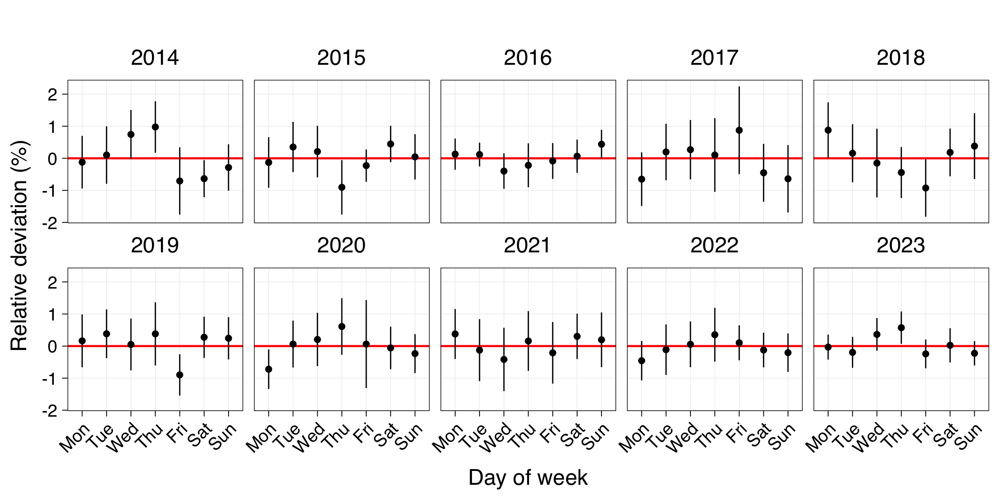

Exploration of Bitcoin price patterns
================
Kristoffer T. Bæk
2025-09-03

## Summary

Dollar cost averaging (DCA) is a strategy for buying cryptocurrency
where you buy for a fixed amount of fiat at predetermined time intervals
e.g \$10 every Tuesday. I used a Bitcoin price index dataset (2011 -
now) to explore if there are any times of the day, the week, or the
month where it would be beneficial to buy. In other words, are there any
consistent daily, weekly or monthly patterns in the price of Bitcoin. I
didn’t find any strong patterns. Probably the strongest, albeit still
weak, is that the price tends to be lower towards the end of a month. I
did not perform any statistical analyses, as I didn’t deem the patterns
worthy of any further investigations.

## Methods

### Data

The hourly bitcoin price index data was downloaded from
[Kaggle](https://www.kaggle.com/datasets/mczielinski/bitcoin-historical-data)
on 28 Aug 2025.

The raw data look like this:

``` r
btc_index <- read_csv("data/BTCUSD_1h_Combined_Index.csv") 

tail(btc_index)
```

    ## # A tibble: 6 × 6
    ##   `Open time`            Open    High     Low   Close    Volume
    ##   <dttm>                <dbl>   <dbl>   <dbl>   <dbl>     <dbl>
    ## 1 2025-08-27 08:00:00 110707. 110866. 110380. 110780. 13375152.
    ## 2 2025-08-27 09:00:00 110780. 111136. 110744. 110844  13063657.
    ## 3 2025-08-27 10:00:00 110844  111290. 110824. 111000. 11506825.
    ## 4 2025-08-27 11:00:00 111000. 111384. 110974. 111331   8331162.
    ## 5 2025-08-27 12:00:00 111331  111423. 111020. 111353. 11723225.
    ## 6 2025-08-27 13:00:00 111353. 111906. 111014. 111556. 42178340.

I used the ‘Close’ price value for all analyses.

I checked the time series for continuity, and only the first and last
day contains less than 24 data points so all seems good.

### Calculating relative deviations

I calculated rolling means with window sizes of 24 hours, 7 days and 30
days. Then I calculated the hourly deviations from those averages as
absolute and relative values.

``` r
btc_index_deviations <- btc_index %>% 
  mutate(
    rollavg_1 = zoo::rollmean(close, k = 24, fill = NA, align = "center"),
    rollavg_7 = zoo::rollmean(close, k = 168, fill = NA, align = "center"),
    rollavg_30 = zoo::rollmean(close, k = 720, fill = NA, align = "center")
  ) %>% 
  pivot_longer(c(-time, -close), names_to = "length", values_to = "rollavg", names_prefix = "rollavg_") %>% 
  mutate(
    length = as.integer(length),
    diff = close - rollavg,
    rel_diff = diff / rollavg
  )
```

An example of the resulting data frame:

``` r
btc_index_deviations %>% filter(year(time) > 2011) %>% arrange(time)
```

    ## # A tibble: 359,106 × 6
    ##    time                close length rollavg     diff rel_diff
    ##    <dttm>              <dbl>  <int>   <dbl>    <dbl>    <dbl>
    ##  1 2012-01-01 00:00:00  4.58      1    4.56  0.0242   0.00530
    ##  2 2012-01-01 00:00:00  4.58      7    4.67 -0.0883  -0.0189 
    ##  3 2012-01-01 00:00:00  4.58     30    5.19 -0.607   -0.117  
    ##  4 2012-01-01 01:00:00  4.58      1    4.56  0.0162   0.00356
    ##  5 2012-01-01 01:00:00  4.58      7    4.67 -0.0937  -0.0200 
    ##  6 2012-01-01 01:00:00  4.58     30    5.19 -0.612   -0.118  
    ##  7 2012-01-01 02:00:00  4.58      1    4.57  0.00833  0.00182
    ##  8 2012-01-01 02:00:00  4.58      7    4.68 -0.0990  -0.0212 
    ##  9 2012-01-01 02:00:00  4.58     30    5.20 -0.617   -0.119  
    ## 10 2012-01-01 03:00:00  4.58      1    4.59 -0.0104  -0.00227
    ## # ℹ 359,096 more rows

## Results

### Overview of the time series

I just wanted to get an idea of the data and plotted three different
time periods.

<figure>

<figcaption aria-hidden="true"><strong>Figure 1: BTC rate over
time</strong>. Shown for three different time periods.</figcaption>
</figure>

### Deviations from the average

I calculated the rolling means as described above. They look like this:

<figure>

<figcaption aria-hidden="true"><strong>Figure 2: BTC rate and rolling
means.</strong> Hourly prices and rolling means with window sizes of 1,
7, and 30 days, respectively. For illustration, only a few months of
2025 is shown.</figcaption>
</figure>

 

Then I calculated the relative deviation from those rolling means, and
used them for the rest of the analyses. For all further analyses, I
looked at the ten year period from 2014 to 2023. The deviations from the
means look like this:

<figure>

<figcaption aria-hidden="true"><strong>Figure 3: Deviations from rolling
means</strong>. Hourly deviations from rolling means with window sizes
of 1, 7, and 30 days, respectively.</figcaption>
</figure>

 

First I wanted to see if there’s any hour of the day where the BTC price
tends to be higher or lower. So I used the relative deviation from the
24-hour rolling mean. I removed outliers, both to the make the plots
easier to interpret and to prevent a few outliers from skewing the
results. The data points I removed had values outside the -10% to + 10%
range (35 data points, 0.04% of the data). As seen in the plot below,
there’s basically no pattern.

<figure>

<figcaption aria-hidden="true"><strong>Figure 4: Deviations from 24-hour
rolling mean</strong>. Hourly deviations from rolling mean with window
sizes of 24 hours. The gray points indicate the deviation from the mean
for each hour in the data set. The horizontal bars indicate the average
deviation, and the vertical bars indicate the standard
deviation.</figcaption>
</figure>

 

Then I did the same for the weekdays and used the 7-day rolling mean to
calculate the relative deviations. Here, I also removed outliers with
values outside the -10% to + 10% range (718 data points, 0.82% of the
data).

<figure>

<figcaption aria-hidden="true"><strong>Figure 5: Deviations from 7-day
rolling mean</strong>. Hourly deviations from rolling mean with window
size 7 days. The gray points indicate the deviation from the mean for
each hour in the data set. The horizontal bars indicate the average
deviation, and the vertical bars indicate the standard
deviation.</figcaption>
</figure>

 

Here we can see a slight tendency for e.g Friday to be lower than
average but the spread is very large. I wanted to see if this pattern
was consistent over time, and looked at each year separately:

<figure>

<figcaption aria-hidden="true"><strong>Figure 6: Deviations from 7-day
rolling mean shown per year</strong>. Hourly deviations from rolling
mean with window size 7 days. The gray points indicate the deviation
from the mean for each hour in the data set. The horizontal bars
indicate the average deviation, and the vertical bars indicate the
standard deviation.</figcaption>
</figure>

 

There’s quite a bit of variation from year to year. For five years out
of the ten, Fridays are lower, but the spread is very large and the mean
differences are very small. So no strong tendency.

I then wanted to see if I could find a pattern if I combined time of day
with day of week, using deviations from the 7-day rolling mean:

<figure>

<figcaption aria-hidden="true"><strong>Figure 7: Deviations from 7-day
rolling mean shown per year</strong>. Average hourly deviations from
rolling mean with window size 7 days.</figcaption>
</figure>

 

Lastly, I wanted to see if time of month had an impact. Here, I removed
outliers with values outside the -20% to + 20% range (592 data points,
0.68% of the data).

<figure>

<figcaption aria-hidden="true"><strong>Figure 8: Deviations from 30-day
rolling mean</strong>. Hourly deviations from rolling mean with window
size 30 days. The gray points indicate the deviation from the mean for
each hour in the data set. The horizontal bars indicate the average
deviation, and the vertical bars indicate the standard
deviation.</figcaption>
</figure>

 

We see a tendency for lower prices towards the end of a month, and
higher prices in the first third of the month. Again, I looked at this
per year to see if this tendency is consistent:

<figure>

<figcaption aria-hidden="true"><strong>Figure 9: Deviations from 30-day
rolling mean shown per year</strong>. Hourly deviations from rolling
mean with window size 30 days. The gray points indicate the deviation
from the mean for each hour in the data set. The horizontal bars
indicate the average deviation, and the vertical bars indicate the
standard deviation.</figcaption>
</figure>

 

There’s a bit of variation from year to year. I tried to look at parts
of the month instead: beginning, middle and end.

<figure>

<figcaption aria-hidden="true"><strong>Figure 10: Deviations from 30-day
rolling mean shown per year</strong>. Hourly deviations from rolling
mean with window size 30 days. The gray points indicate the deviation
from the mean for each hour in the data set. The horizontal bars
indicate the average deviation, and the vertical bars indicate the
standard deviation.</figcaption>
</figure>
