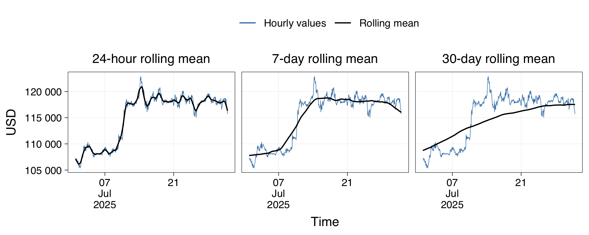
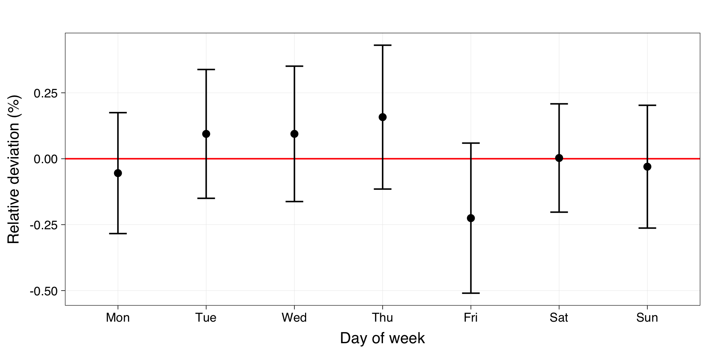

Exploration of Bitcoin price patterns
================
Kristoffer T. Bæk
2025-09-17

# Summary

Dollar-cost averaging (DCA) is a common way to buy cryptocurrency where
you invest a fixed amount at fixed intervals, regardless of the price.
This raises the question if some times of the day, week, or month are
consistently better for buying. To find out, I analyzed hourly Bitcoin
price data from 2014–2023. I measured how far prices deviated from
rolling averages (1-day, 7-day, and 30-day windows) and tested calendar
effects using one-way ANOVA. In addition to testing statistical
significance, I calculated effect size
()
to judge whether any detected patterns are practically meaningful. I
found that hour of day, and day of week only had negligible effects on
the price
(
= 0.001 and

= 0.002, respectively). The effect of day of month was small
(
= 0.02) with slightly lower prices near the end of the month, but this
pattern was not consistent across years. Finally, I checked whether any
signals persisted in more recent sub-periods. In conclusion, across a
decade of data, calendar timing offered no obvious edge for DCA.

# Methods

## Data

The hourly bitcoin price index data was downloaded from
[Kaggle](https://www.kaggle.com/datasets/mczielinski/bitcoin-historical-data)
on 28 Aug 2025. (When I checked the link on 10 Sep 2025, it seems this
dataset had been replaced by a 1-minute price index dataset, which I
haven’t used). A snippet of the raw data is shown in the table below.

``` r
btc_index <- read_csv("data/BTCUSD_1h_Combined_Index.csv") 
```

<div id="vohfpcjppo" style="padding-left:0px;padding-right:0px;padding-top:10px;padding-bottom:10px;overflow-x:auto;overflow-y:auto;width:auto;height:auto;">
<style>#vohfpcjppo table {
  font-family: system-ui, 'Segoe UI', Roboto, Helvetica, Arial, sans-serif, 'Apple Color Emoji', 'Segoe UI Emoji', 'Segoe UI Symbol', 'Noto Color Emoji';
  -webkit-font-smoothing: antialiased;
  -moz-osx-font-smoothing: grayscale;
}
&#10;#vohfpcjppo thead, #vohfpcjppo tbody, #vohfpcjppo tfoot, #vohfpcjppo tr, #vohfpcjppo td, #vohfpcjppo th {
  border-style: none;
}
&#10;#vohfpcjppo p {
  margin: 0;
  padding: 0;
}
&#10;#vohfpcjppo .gt_table {
  display: table;
  border-collapse: collapse;
  line-height: normal;
  margin-left: auto;
  margin-right: auto;
  color: #333333;
  font-size: 16px;
  font-weight: normal;
  font-style: normal;
  background-color: #FFFFFF;
  width: auto;
  border-top-style: solid;
  border-top-width: 2px;
  border-top-color: #A8A8A8;
  border-right-style: none;
  border-right-width: 2px;
  border-right-color: #D3D3D3;
  border-bottom-style: solid;
  border-bottom-width: 2px;
  border-bottom-color: #A8A8A8;
  border-left-style: none;
  border-left-width: 2px;
  border-left-color: #D3D3D3;
}
&#10;#vohfpcjppo .gt_caption {
  padding-top: 4px;
  padding-bottom: 4px;
}
&#10;#vohfpcjppo .gt_title {
  color: #333333;
  font-size: 125%;
  font-weight: initial;
  padding-top: 4px;
  padding-bottom: 4px;
  padding-left: 5px;
  padding-right: 5px;
  border-bottom-color: #FFFFFF;
  border-bottom-width: 0;
}
&#10;#vohfpcjppo .gt_subtitle {
  color: #333333;
  font-size: 85%;
  font-weight: initial;
  padding-top: 3px;
  padding-bottom: 5px;
  padding-left: 5px;
  padding-right: 5px;
  border-top-color: #FFFFFF;
  border-top-width: 0;
}
&#10;#vohfpcjppo .gt_heading {
  background-color: #FFFFFF;
  text-align: center;
  border-bottom-color: #FFFFFF;
  border-left-style: none;
  border-left-width: 1px;
  border-left-color: #D3D3D3;
  border-right-style: none;
  border-right-width: 1px;
  border-right-color: #D3D3D3;
}
&#10;#vohfpcjppo .gt_bottom_border {
  border-bottom-style: solid;
  border-bottom-width: 2px;
  border-bottom-color: #D3D3D3;
}
&#10;#vohfpcjppo .gt_col_headings {
  border-top-style: solid;
  border-top-width: 2px;
  border-top-color: #D3D3D3;
  border-bottom-style: solid;
  border-bottom-width: 2px;
  border-bottom-color: #D3D3D3;
  border-left-style: none;
  border-left-width: 1px;
  border-left-color: #D3D3D3;
  border-right-style: none;
  border-right-width: 1px;
  border-right-color: #D3D3D3;
}
&#10;#vohfpcjppo .gt_col_heading {
  color: #333333;
  background-color: #FFFFFF;
  font-size: 100%;
  font-weight: normal;
  text-transform: inherit;
  border-left-style: none;
  border-left-width: 1px;
  border-left-color: #D3D3D3;
  border-right-style: none;
  border-right-width: 1px;
  border-right-color: #D3D3D3;
  vertical-align: bottom;
  padding-top: 5px;
  padding-bottom: 6px;
  padding-left: 5px;
  padding-right: 5px;
  overflow-x: hidden;
}
&#10;#vohfpcjppo .gt_column_spanner_outer {
  color: #333333;
  background-color: #FFFFFF;
  font-size: 100%;
  font-weight: normal;
  text-transform: inherit;
  padding-top: 0;
  padding-bottom: 0;
  padding-left: 4px;
  padding-right: 4px;
}
&#10;#vohfpcjppo .gt_column_spanner_outer:first-child {
  padding-left: 0;
}
&#10;#vohfpcjppo .gt_column_spanner_outer:last-child {
  padding-right: 0;
}
&#10;#vohfpcjppo .gt_column_spanner {
  border-bottom-style: solid;
  border-bottom-width: 2px;
  border-bottom-color: #D3D3D3;
  vertical-align: bottom;
  padding-top: 5px;
  padding-bottom: 5px;
  overflow-x: hidden;
  display: inline-block;
  width: 100%;
}
&#10;#vohfpcjppo .gt_spanner_row {
  border-bottom-style: hidden;
}
&#10;#vohfpcjppo .gt_group_heading {
  padding-top: 8px;
  padding-bottom: 8px;
  padding-left: 5px;
  padding-right: 5px;
  color: #333333;
  background-color: #FFFFFF;
  font-size: 100%;
  font-weight: initial;
  text-transform: inherit;
  border-top-style: solid;
  border-top-width: 2px;
  border-top-color: #D3D3D3;
  border-bottom-style: solid;
  border-bottom-width: 2px;
  border-bottom-color: #D3D3D3;
  border-left-style: none;
  border-left-width: 1px;
  border-left-color: #D3D3D3;
  border-right-style: none;
  border-right-width: 1px;
  border-right-color: #D3D3D3;
  vertical-align: middle;
  text-align: left;
}
&#10;#vohfpcjppo .gt_empty_group_heading {
  padding: 0.5px;
  color: #333333;
  background-color: #FFFFFF;
  font-size: 100%;
  font-weight: initial;
  border-top-style: solid;
  border-top-width: 2px;
  border-top-color: #D3D3D3;
  border-bottom-style: solid;
  border-bottom-width: 2px;
  border-bottom-color: #D3D3D3;
  vertical-align: middle;
}
&#10;#vohfpcjppo .gt_from_md > :first-child {
  margin-top: 0;
}
&#10;#vohfpcjppo .gt_from_md > :last-child {
  margin-bottom: 0;
}
&#10;#vohfpcjppo .gt_row {
  padding-top: 8px;
  padding-bottom: 8px;
  padding-left: 5px;
  padding-right: 5px;
  margin: 10px;
  border-top-style: solid;
  border-top-width: 1px;
  border-top-color: #D3D3D3;
  border-left-style: none;
  border-left-width: 1px;
  border-left-color: #D3D3D3;
  border-right-style: none;
  border-right-width: 1px;
  border-right-color: #D3D3D3;
  vertical-align: middle;
  overflow-x: hidden;
}
&#10;#vohfpcjppo .gt_stub {
  color: #333333;
  background-color: #FFFFFF;
  font-size: 100%;
  font-weight: initial;
  text-transform: inherit;
  border-right-style: solid;
  border-right-width: 2px;
  border-right-color: #D3D3D3;
  padding-left: 5px;
  padding-right: 5px;
}
&#10;#vohfpcjppo .gt_stub_row_group {
  color: #333333;
  background-color: #FFFFFF;
  font-size: 100%;
  font-weight: initial;
  text-transform: inherit;
  border-right-style: solid;
  border-right-width: 2px;
  border-right-color: #D3D3D3;
  padding-left: 5px;
  padding-right: 5px;
  vertical-align: top;
}
&#10;#vohfpcjppo .gt_row_group_first td {
  border-top-width: 2px;
}
&#10;#vohfpcjppo .gt_row_group_first th {
  border-top-width: 2px;
}
&#10;#vohfpcjppo .gt_summary_row {
  color: #333333;
  background-color: #FFFFFF;
  text-transform: inherit;
  padding-top: 8px;
  padding-bottom: 8px;
  padding-left: 5px;
  padding-right: 5px;
}
&#10;#vohfpcjppo .gt_first_summary_row {
  border-top-style: solid;
  border-top-color: #D3D3D3;
}
&#10;#vohfpcjppo .gt_first_summary_row.thick {
  border-top-width: 2px;
}
&#10;#vohfpcjppo .gt_last_summary_row {
  padding-top: 8px;
  padding-bottom: 8px;
  padding-left: 5px;
  padding-right: 5px;
  border-bottom-style: solid;
  border-bottom-width: 2px;
  border-bottom-color: #D3D3D3;
}
&#10;#vohfpcjppo .gt_grand_summary_row {
  color: #333333;
  background-color: #FFFFFF;
  text-transform: inherit;
  padding-top: 8px;
  padding-bottom: 8px;
  padding-left: 5px;
  padding-right: 5px;
}
&#10;#vohfpcjppo .gt_first_grand_summary_row {
  padding-top: 8px;
  padding-bottom: 8px;
  padding-left: 5px;
  padding-right: 5px;
  border-top-style: double;
  border-top-width: 6px;
  border-top-color: #D3D3D3;
}
&#10;#vohfpcjppo .gt_last_grand_summary_row_top {
  padding-top: 8px;
  padding-bottom: 8px;
  padding-left: 5px;
  padding-right: 5px;
  border-bottom-style: double;
  border-bottom-width: 6px;
  border-bottom-color: #D3D3D3;
}
&#10;#vohfpcjppo .gt_striped {
  background-color: rgba(128, 128, 128, 0.05);
}
&#10;#vohfpcjppo .gt_table_body {
  border-top-style: solid;
  border-top-width: 2px;
  border-top-color: #D3D3D3;
  border-bottom-style: solid;
  border-bottom-width: 2px;
  border-bottom-color: #D3D3D3;
}
&#10;#vohfpcjppo .gt_footnotes {
  color: #333333;
  background-color: #FFFFFF;
  border-bottom-style: none;
  border-bottom-width: 2px;
  border-bottom-color: #D3D3D3;
  border-left-style: none;
  border-left-width: 2px;
  border-left-color: #D3D3D3;
  border-right-style: none;
  border-right-width: 2px;
  border-right-color: #D3D3D3;
}
&#10;#vohfpcjppo .gt_footnote {
  margin: 0px;
  font-size: 90%;
  padding-top: 4px;
  padding-bottom: 4px;
  padding-left: 5px;
  padding-right: 5px;
}
&#10;#vohfpcjppo .gt_sourcenotes {
  color: #333333;
  background-color: #FFFFFF;
  border-bottom-style: none;
  border-bottom-width: 2px;
  border-bottom-color: #D3D3D3;
  border-left-style: none;
  border-left-width: 2px;
  border-left-color: #D3D3D3;
  border-right-style: none;
  border-right-width: 2px;
  border-right-color: #D3D3D3;
}
&#10;#vohfpcjppo .gt_sourcenote {
  font-size: 90%;
  padding-top: 4px;
  padding-bottom: 4px;
  padding-left: 5px;
  padding-right: 5px;
}
&#10;#vohfpcjppo .gt_left {
  text-align: left;
}
&#10;#vohfpcjppo .gt_center {
  text-align: center;
}
&#10;#vohfpcjppo .gt_right {
  text-align: right;
  font-variant-numeric: tabular-nums;
}
&#10;#vohfpcjppo .gt_font_normal {
  font-weight: normal;
}
&#10;#vohfpcjppo .gt_font_bold {
  font-weight: bold;
}
&#10;#vohfpcjppo .gt_font_italic {
  font-style: italic;
}
&#10;#vohfpcjppo .gt_super {
  font-size: 65%;
}
&#10;#vohfpcjppo .gt_footnote_marks {
  font-size: 75%;
  vertical-align: 0.4em;
  position: initial;
}
&#10;#vohfpcjppo .gt_asterisk {
  font-size: 100%;
  vertical-align: 0;
}
&#10;#vohfpcjppo .gt_indent_1 {
  text-indent: 5px;
}
&#10;#vohfpcjppo .gt_indent_2 {
  text-indent: 10px;
}
&#10;#vohfpcjppo .gt_indent_3 {
  text-indent: 15px;
}
&#10;#vohfpcjppo .gt_indent_4 {
  text-indent: 20px;
}
&#10;#vohfpcjppo .gt_indent_5 {
  text-indent: 25px;
}
&#10;#vohfpcjppo .katex-display {
  display: inline-flex !important;
  margin-bottom: 0.75em !important;
}
&#10;#vohfpcjppo div.Reactable > div.rt-table > div.rt-thead > div.rt-tr.rt-tr-group-header > div.rt-th-group:after {
  height: 0px !important;
}
</style>
<table class="gt_table" data-quarto-disable-processing="false" data-quarto-bootstrap="false">
  <thead>
    <tr class="gt_col_headings">
      <th class="gt_col_heading gt_columns_bottom_border gt_right" rowspan="1" colspan="1" scope="col" id="Open-time">Open time</th>
      <th class="gt_col_heading gt_columns_bottom_border gt_right" rowspan="1" colspan="1" scope="col" id="Open">Open</th>
      <th class="gt_col_heading gt_columns_bottom_border gt_right" rowspan="1" colspan="1" scope="col" id="High">High</th>
      <th class="gt_col_heading gt_columns_bottom_border gt_right" rowspan="1" colspan="1" scope="col" id="Low">Low</th>
      <th class="gt_col_heading gt_columns_bottom_border gt_right" rowspan="1" colspan="1" scope="col" id="Close">Close</th>
      <th class="gt_col_heading gt_columns_bottom_border gt_right" rowspan="1" colspan="1" scope="col" id="Volume">Volume</th>
    </tr>
  </thead>
  <tbody class="gt_table_body">
    <tr><td headers="Open time" class="gt_row gt_right">2025-08-27 11:00:00</td>
<td headers="Open" class="gt_row gt_right">110999.6</td>
<td headers="High" class="gt_row gt_right">111384.0</td>
<td headers="Low" class="gt_row gt_right">110974.1</td>
<td headers="Close" class="gt_row gt_right">111331.0</td>
<td headers="Volume" class="gt_row gt_right">8331162</td></tr>
    <tr><td headers="Open time" class="gt_row gt_right">2025-08-27 12:00:00</td>
<td headers="Open" class="gt_row gt_right">111331.0</td>
<td headers="High" class="gt_row gt_right">111423.4</td>
<td headers="Low" class="gt_row gt_right">111020.5</td>
<td headers="Close" class="gt_row gt_right">111352.7</td>
<td headers="Volume" class="gt_row gt_right">11723225</td></tr>
    <tr><td headers="Open time" class="gt_row gt_right">2025-08-27 13:00:00</td>
<td headers="Open" class="gt_row gt_right">111352.7</td>
<td headers="High" class="gt_row gt_right">111906.4</td>
<td headers="Low" class="gt_row gt_right">111014.0</td>
<td headers="Close" class="gt_row gt_right">111556.1</td>
<td headers="Volume" class="gt_row gt_right">42178340</td></tr>
  </tbody>
  &#10;  
</table>
</div>

I used the ‘Close’ price value for all analyses, and checked the time
series for continuity. Only the first and last day contains less than 24
data points indicating that the time series is continuous. I created
subsets of the dataset spanning the years 2014-2023, 2019-2023 and
2022-2023 containing 87,648, 43,824 and 17,520 time points,
respectively.

## Relative deviations

I calculated rolling means with window sizes of 24 hours, 7 days and 30
days. Then I calculated the hourly deviations from those averages as
absolute and relative values.

An example of the resulting data frame is shown below:

<div id="qxgwxkntwz" style="padding-left:0px;padding-right:0px;padding-top:10px;padding-bottom:10px;overflow-x:auto;overflow-y:auto;width:auto;height:auto;">
<style>#qxgwxkntwz table {
  font-family: system-ui, 'Segoe UI', Roboto, Helvetica, Arial, sans-serif, 'Apple Color Emoji', 'Segoe UI Emoji', 'Segoe UI Symbol', 'Noto Color Emoji';
  -webkit-font-smoothing: antialiased;
  -moz-osx-font-smoothing: grayscale;
}
&#10;#qxgwxkntwz thead, #qxgwxkntwz tbody, #qxgwxkntwz tfoot, #qxgwxkntwz tr, #qxgwxkntwz td, #qxgwxkntwz th {
  border-style: none;
}
&#10;#qxgwxkntwz p {
  margin: 0;
  padding: 0;
}
&#10;#qxgwxkntwz .gt_table {
  display: table;
  border-collapse: collapse;
  line-height: normal;
  margin-left: auto;
  margin-right: auto;
  color: #333333;
  font-size: 16px;
  font-weight: normal;
  font-style: normal;
  background-color: #FFFFFF;
  width: auto;
  border-top-style: solid;
  border-top-width: 2px;
  border-top-color: #A8A8A8;
  border-right-style: none;
  border-right-width: 2px;
  border-right-color: #D3D3D3;
  border-bottom-style: solid;
  border-bottom-width: 2px;
  border-bottom-color: #A8A8A8;
  border-left-style: none;
  border-left-width: 2px;
  border-left-color: #D3D3D3;
}
&#10;#qxgwxkntwz .gt_caption {
  padding-top: 4px;
  padding-bottom: 4px;
}
&#10;#qxgwxkntwz .gt_title {
  color: #333333;
  font-size: 125%;
  font-weight: initial;
  padding-top: 4px;
  padding-bottom: 4px;
  padding-left: 5px;
  padding-right: 5px;
  border-bottom-color: #FFFFFF;
  border-bottom-width: 0;
}
&#10;#qxgwxkntwz .gt_subtitle {
  color: #333333;
  font-size: 85%;
  font-weight: initial;
  padding-top: 3px;
  padding-bottom: 5px;
  padding-left: 5px;
  padding-right: 5px;
  border-top-color: #FFFFFF;
  border-top-width: 0;
}
&#10;#qxgwxkntwz .gt_heading {
  background-color: #FFFFFF;
  text-align: center;
  border-bottom-color: #FFFFFF;
  border-left-style: none;
  border-left-width: 1px;
  border-left-color: #D3D3D3;
  border-right-style: none;
  border-right-width: 1px;
  border-right-color: #D3D3D3;
}
&#10;#qxgwxkntwz .gt_bottom_border {
  border-bottom-style: solid;
  border-bottom-width: 2px;
  border-bottom-color: #D3D3D3;
}
&#10;#qxgwxkntwz .gt_col_headings {
  border-top-style: solid;
  border-top-width: 2px;
  border-top-color: #D3D3D3;
  border-bottom-style: solid;
  border-bottom-width: 2px;
  border-bottom-color: #D3D3D3;
  border-left-style: none;
  border-left-width: 1px;
  border-left-color: #D3D3D3;
  border-right-style: none;
  border-right-width: 1px;
  border-right-color: #D3D3D3;
}
&#10;#qxgwxkntwz .gt_col_heading {
  color: #333333;
  background-color: #FFFFFF;
  font-size: 100%;
  font-weight: normal;
  text-transform: inherit;
  border-left-style: none;
  border-left-width: 1px;
  border-left-color: #D3D3D3;
  border-right-style: none;
  border-right-width: 1px;
  border-right-color: #D3D3D3;
  vertical-align: bottom;
  padding-top: 5px;
  padding-bottom: 6px;
  padding-left: 5px;
  padding-right: 5px;
  overflow-x: hidden;
}
&#10;#qxgwxkntwz .gt_column_spanner_outer {
  color: #333333;
  background-color: #FFFFFF;
  font-size: 100%;
  font-weight: normal;
  text-transform: inherit;
  padding-top: 0;
  padding-bottom: 0;
  padding-left: 4px;
  padding-right: 4px;
}
&#10;#qxgwxkntwz .gt_column_spanner_outer:first-child {
  padding-left: 0;
}
&#10;#qxgwxkntwz .gt_column_spanner_outer:last-child {
  padding-right: 0;
}
&#10;#qxgwxkntwz .gt_column_spanner {
  border-bottom-style: solid;
  border-bottom-width: 2px;
  border-bottom-color: #D3D3D3;
  vertical-align: bottom;
  padding-top: 5px;
  padding-bottom: 5px;
  overflow-x: hidden;
  display: inline-block;
  width: 100%;
}
&#10;#qxgwxkntwz .gt_spanner_row {
  border-bottom-style: hidden;
}
&#10;#qxgwxkntwz .gt_group_heading {
  padding-top: 8px;
  padding-bottom: 8px;
  padding-left: 5px;
  padding-right: 5px;
  color: #333333;
  background-color: #FFFFFF;
  font-size: 100%;
  font-weight: initial;
  text-transform: inherit;
  border-top-style: solid;
  border-top-width: 2px;
  border-top-color: #D3D3D3;
  border-bottom-style: solid;
  border-bottom-width: 2px;
  border-bottom-color: #D3D3D3;
  border-left-style: none;
  border-left-width: 1px;
  border-left-color: #D3D3D3;
  border-right-style: none;
  border-right-width: 1px;
  border-right-color: #D3D3D3;
  vertical-align: middle;
  text-align: left;
}
&#10;#qxgwxkntwz .gt_empty_group_heading {
  padding: 0.5px;
  color: #333333;
  background-color: #FFFFFF;
  font-size: 100%;
  font-weight: initial;
  border-top-style: solid;
  border-top-width: 2px;
  border-top-color: #D3D3D3;
  border-bottom-style: solid;
  border-bottom-width: 2px;
  border-bottom-color: #D3D3D3;
  vertical-align: middle;
}
&#10;#qxgwxkntwz .gt_from_md > :first-child {
  margin-top: 0;
}
&#10;#qxgwxkntwz .gt_from_md > :last-child {
  margin-bottom: 0;
}
&#10;#qxgwxkntwz .gt_row {
  padding-top: 8px;
  padding-bottom: 8px;
  padding-left: 5px;
  padding-right: 5px;
  margin: 10px;
  border-top-style: solid;
  border-top-width: 1px;
  border-top-color: #D3D3D3;
  border-left-style: none;
  border-left-width: 1px;
  border-left-color: #D3D3D3;
  border-right-style: none;
  border-right-width: 1px;
  border-right-color: #D3D3D3;
  vertical-align: middle;
  overflow-x: hidden;
}
&#10;#qxgwxkntwz .gt_stub {
  color: #333333;
  background-color: #FFFFFF;
  font-size: 100%;
  font-weight: initial;
  text-transform: inherit;
  border-right-style: solid;
  border-right-width: 2px;
  border-right-color: #D3D3D3;
  padding-left: 5px;
  padding-right: 5px;
}
&#10;#qxgwxkntwz .gt_stub_row_group {
  color: #333333;
  background-color: #FFFFFF;
  font-size: 100%;
  font-weight: initial;
  text-transform: inherit;
  border-right-style: solid;
  border-right-width: 2px;
  border-right-color: #D3D3D3;
  padding-left: 5px;
  padding-right: 5px;
  vertical-align: top;
}
&#10;#qxgwxkntwz .gt_row_group_first td {
  border-top-width: 2px;
}
&#10;#qxgwxkntwz .gt_row_group_first th {
  border-top-width: 2px;
}
&#10;#qxgwxkntwz .gt_summary_row {
  color: #333333;
  background-color: #FFFFFF;
  text-transform: inherit;
  padding-top: 8px;
  padding-bottom: 8px;
  padding-left: 5px;
  padding-right: 5px;
}
&#10;#qxgwxkntwz .gt_first_summary_row {
  border-top-style: solid;
  border-top-color: #D3D3D3;
}
&#10;#qxgwxkntwz .gt_first_summary_row.thick {
  border-top-width: 2px;
}
&#10;#qxgwxkntwz .gt_last_summary_row {
  padding-top: 8px;
  padding-bottom: 8px;
  padding-left: 5px;
  padding-right: 5px;
  border-bottom-style: solid;
  border-bottom-width: 2px;
  border-bottom-color: #D3D3D3;
}
&#10;#qxgwxkntwz .gt_grand_summary_row {
  color: #333333;
  background-color: #FFFFFF;
  text-transform: inherit;
  padding-top: 8px;
  padding-bottom: 8px;
  padding-left: 5px;
  padding-right: 5px;
}
&#10;#qxgwxkntwz .gt_first_grand_summary_row {
  padding-top: 8px;
  padding-bottom: 8px;
  padding-left: 5px;
  padding-right: 5px;
  border-top-style: double;
  border-top-width: 6px;
  border-top-color: #D3D3D3;
}
&#10;#qxgwxkntwz .gt_last_grand_summary_row_top {
  padding-top: 8px;
  padding-bottom: 8px;
  padding-left: 5px;
  padding-right: 5px;
  border-bottom-style: double;
  border-bottom-width: 6px;
  border-bottom-color: #D3D3D3;
}
&#10;#qxgwxkntwz .gt_striped {
  background-color: rgba(128, 128, 128, 0.05);
}
&#10;#qxgwxkntwz .gt_table_body {
  border-top-style: solid;
  border-top-width: 2px;
  border-top-color: #D3D3D3;
  border-bottom-style: solid;
  border-bottom-width: 2px;
  border-bottom-color: #D3D3D3;
}
&#10;#qxgwxkntwz .gt_footnotes {
  color: #333333;
  background-color: #FFFFFF;
  border-bottom-style: none;
  border-bottom-width: 2px;
  border-bottom-color: #D3D3D3;
  border-left-style: none;
  border-left-width: 2px;
  border-left-color: #D3D3D3;
  border-right-style: none;
  border-right-width: 2px;
  border-right-color: #D3D3D3;
}
&#10;#qxgwxkntwz .gt_footnote {
  margin: 0px;
  font-size: 90%;
  padding-top: 4px;
  padding-bottom: 4px;
  padding-left: 5px;
  padding-right: 5px;
}
&#10;#qxgwxkntwz .gt_sourcenotes {
  color: #333333;
  background-color: #FFFFFF;
  border-bottom-style: none;
  border-bottom-width: 2px;
  border-bottom-color: #D3D3D3;
  border-left-style: none;
  border-left-width: 2px;
  border-left-color: #D3D3D3;
  border-right-style: none;
  border-right-width: 2px;
  border-right-color: #D3D3D3;
}
&#10;#qxgwxkntwz .gt_sourcenote {
  font-size: 90%;
  padding-top: 4px;
  padding-bottom: 4px;
  padding-left: 5px;
  padding-right: 5px;
}
&#10;#qxgwxkntwz .gt_left {
  text-align: left;
}
&#10;#qxgwxkntwz .gt_center {
  text-align: center;
}
&#10;#qxgwxkntwz .gt_right {
  text-align: right;
  font-variant-numeric: tabular-nums;
}
&#10;#qxgwxkntwz .gt_font_normal {
  font-weight: normal;
}
&#10;#qxgwxkntwz .gt_font_bold {
  font-weight: bold;
}
&#10;#qxgwxkntwz .gt_font_italic {
  font-style: italic;
}
&#10;#qxgwxkntwz .gt_super {
  font-size: 65%;
}
&#10;#qxgwxkntwz .gt_footnote_marks {
  font-size: 75%;
  vertical-align: 0.4em;
  position: initial;
}
&#10;#qxgwxkntwz .gt_asterisk {
  font-size: 100%;
  vertical-align: 0;
}
&#10;#qxgwxkntwz .gt_indent_1 {
  text-indent: 5px;
}
&#10;#qxgwxkntwz .gt_indent_2 {
  text-indent: 10px;
}
&#10;#qxgwxkntwz .gt_indent_3 {
  text-indent: 15px;
}
&#10;#qxgwxkntwz .gt_indent_4 {
  text-indent: 20px;
}
&#10;#qxgwxkntwz .gt_indent_5 {
  text-indent: 25px;
}
&#10;#qxgwxkntwz .katex-display {
  display: inline-flex !important;
  margin-bottom: 0.75em !important;
}
&#10;#qxgwxkntwz div.Reactable > div.rt-table > div.rt-thead > div.rt-tr.rt-tr-group-header > div.rt-th-group:after {
  height: 0px !important;
}
</style>
<table class="gt_table" data-quarto-disable-processing="false" data-quarto-bootstrap="false">
  <thead>
    <tr class="gt_col_headings">
      <th class="gt_col_heading gt_columns_bottom_border gt_right" rowspan="1" colspan="1" scope="col" id="time">time</th>
      <th class="gt_col_heading gt_columns_bottom_border gt_right" rowspan="1" colspan="1" scope="col" id="close">close</th>
      <th class="gt_col_heading gt_columns_bottom_border gt_right" rowspan="1" colspan="1" scope="col" id="length">length</th>
      <th class="gt_col_heading gt_columns_bottom_border gt_right" rowspan="1" colspan="1" scope="col" id="rollavg">rollavg</th>
      <th class="gt_col_heading gt_columns_bottom_border gt_right" rowspan="1" colspan="1" scope="col" id="diff">diff</th>
      <th class="gt_col_heading gt_columns_bottom_border gt_right" rowspan="1" colspan="1" scope="col" id="rel_diff">rel_diff</th>
    </tr>
  </thead>
  <tbody class="gt_table_body">
    <tr><td headers="time" class="gt_row gt_right">2014-12-31 23:00:00</td>
<td headers="close" class="gt_row gt_right">322.09</td>
<td headers="length" class="gt_row gt_right">1</td>
<td headers="rollavg" class="gt_row gt_right">316.6521</td>
<td headers="diff" class="gt_row gt_right">5.437917</td>
<td headers="rel_diff" class="gt_row gt_right">0.01717316</td></tr>
    <tr><td headers="time" class="gt_row gt_right">2014-12-31 23:00:00</td>
<td headers="close" class="gt_row gt_right">322.09</td>
<td headers="length" class="gt_row gt_right">7</td>
<td headers="rollavg" class="gt_row gt_right">311.0397</td>
<td headers="diff" class="gt_row gt_right">11.050298</td>
<td headers="rel_diff" class="gt_row gt_right">0.03552697</td></tr>
    <tr><td headers="time" class="gt_row gt_right">2014-12-31 23:00:00</td>
<td headers="close" class="gt_row gt_right">322.09</td>
<td headers="length" class="gt_row gt_right">30</td>
<td headers="rollavg" class="gt_row gt_right">297.2398</td>
<td headers="diff" class="gt_row gt_right">24.850181</td>
<td headers="rel_diff" class="gt_row gt_right">0.08360313</td></tr>
  </tbody>
  &#10;  
</table>
</div>

## Statistical analyses

For each calendar factor I fit a one-way ANOVA of relative deviation on
the factor (e.g., deviation ~ factor(hour)). I report

(equivalent to ANOVA
)
as the primary effect size and the model *p*-value for context.
Interpretation emphasizes effect sizes and economic magnitudes
(highest–lowest mean difference in percentage points), not just
statistical detectability.

# Results

To detect any repeating daily, weekly or monthly patterns in the BTC
price index, I calculated three different rolling means with varying
window-sizes (24 hours, 7 days and 30 days, **Figure 1**), and analyzed
how much the hourly price deviates from the mean by calculating the
relative deviation. For the first part of the analysis, I looked at the
ten year period from 2014 to 2023. The idea was to use the data from
2024-2025 as a hold-out to test any predictions that might result from
the 2014-2023 analyses.

<figure>

<figcaption aria-hidden="true"><strong>Figure 1: BTC rate and rolling
means.</strong> Hourly prices and rolling means with window sizes of 1,
7, and 30 days, respectively. For illustration, only one month of 2025
is shown.</figcaption>
</figure>

## Hour of day

First, I wanted to see if certain hours of day consistently offer
cheaper prices. Using the 24-hour rolling mean, I compared deviations by
hour (**Figure 2**). We can see that means with 95% confidence intervals
overlap heavily across all hours. ANOVA detected tiny but statistically
significant differences (*p* = 0.000044), but the effect size was
negligible
(
= 0.00068), meaning that hour of day explains less than 0.1% of the
variance in deviations. In conclusion, hour of day has no meaningful
effect on price deviations, and therefore no value for timing recurring
buys.

<figure>

<figcaption aria-hidden="true"><strong>Figure 2: Mean relative deviation
by hour of day (with 95% CI)</strong>. The mean relative deviations
(black circle) for each hour of the day and the 95% CI intervals
(vertical bars) are indicated. Times in UTC.</figcaption>
</figure>

## Day of week pattern

Then I did the same analysis for weekdays but used the 7-day rolling
mean to calculate the relative deviations. We can see a large overlap
when plotting means with 95% CIs (**Figure 3**). As for the hour of day
analysis, I performed a one-way ANOVA test and calculated the effect
size. First, I only looked at time 00:00 UTC for each day. ANOVA
detected no statistically significant (*p* = 0.42) difference between
days of the week. To test if any statistically significant differences
would be detected if I used another time of day, I calculated the
*p*-value and the effect size
()
for each hour of the day. I found that if I use hour 13:00 UTC, the
*p*-value falls below the 0.05 threshold with an effect size of
(
= 0.0035) meaning that the day of week explains 0.4% of the variance in
deviations. However, this is a single marginal signal among 24 parallel
tests, and the apparent weekday pattern varies heavily across years
(**Figure 4**). Taken together, this indicates that weekday effects are
essentially irrelevant for timing recurring buys.

<figure>

<figcaption aria-hidden="true"><strong>Figure 3: Mean relative deviation
by day of week (with 95% CI)</strong>. The mean relative deviations for
each day of the week at 00:00 UTC (black circle) and the 95% CI
intervals (vertical bars) are indicated.</figcaption>
</figure>

<figure>

<figcaption aria-hidden="true"><strong>Figure 4: Mean relative deviation
by day of week (with 95% CI) for each seperate year</strong>. The mean
relative deviations for each day of the week at 00:00 UTC (black circle)
and the 95% CI intervals (vertical bars) are indicated.</figcaption>
</figure>

## Day of month pattern

Lastly, I tested whether time of month had an impact using deviations
from the 30-day rolling mean. Plotting means with 95% CIs shows some
separation across days (**Figure 5**). As before, I performed a one-way
ANOVA test and calculated the effect size. At 00:00 UTC, ANOVA detected
a statistically significant difference (*p* = 0.000031) with an effect
size of
(
= 0.019), meaning day of month explains 1.9% of the variance. Repeating
the test across all hours of the day again yielded statistically
significant results (*p* \< 0.05), with effect sizes ranging from

= 0.019 and

= 0.021. However, the apparent pattern shifts substantially from year to
year (**Figure 6**), all in all suggesting that any month-end effect is
weak and unstable.

<figure>

<figcaption aria-hidden="true"><strong>Figure 5: Mean relative deviation
by day of month (with 95% CI)</strong>. The mean relative deviations for
each day of the month at 00:00 UTC (black circle) and the 95% CI
intervals (vertical bars) are indicated.</figcaption>
</figure>

<figure>

<figcaption aria-hidden="true"><strong>Figure 6: Mean relative deviation
by day of month (with 95% CI) for each seperate year</strong>. The mean
relative deviations for each day of the month at 00:00 UTC (black
circle) and the 95% CI intervals (vertical bars) are
indicated.</figcaption>
</figure>

# Shorter time periods

To test stability, I recomputed the hour/weekday/month summaries over
2014–2023, 2019–2023, and 2022–2023. Each window repeats the same
methodology. The results shown in the table below emphasize the earlier
conclusions. Hour and weekday remain negligible in every window. The
day-of-month effect that is weakly present over 2014–2023 does not
replicate in 2022–2023 (large *p*,

≈ 0), indicating that any apparent month-end dip is regime-dependent
rather than a durable pattern.

<div id="iwsxmwqsjj" style="padding-left:0px;padding-right:0px;padding-top:10px;padding-bottom:10px;overflow-x:auto;overflow-y:auto;width:auto;height:auto;">
<style>#iwsxmwqsjj table {
  font-family: system-ui, 'Segoe UI', Roboto, Helvetica, Arial, sans-serif, 'Apple Color Emoji', 'Segoe UI Emoji', 'Segoe UI Symbol', 'Noto Color Emoji';
  -webkit-font-smoothing: antialiased;
  -moz-osx-font-smoothing: grayscale;
}
&#10;#iwsxmwqsjj thead, #iwsxmwqsjj tbody, #iwsxmwqsjj tfoot, #iwsxmwqsjj tr, #iwsxmwqsjj td, #iwsxmwqsjj th {
  border-style: none;
}
&#10;#iwsxmwqsjj p {
  margin: 0;
  padding: 0;
}
&#10;#iwsxmwqsjj .gt_table {
  display: table;
  border-collapse: collapse;
  line-height: normal;
  margin-left: auto;
  margin-right: auto;
  color: #333333;
  font-size: 16px;
  font-weight: normal;
  font-style: normal;
  background-color: #FFFFFF;
  width: auto;
  border-top-style: solid;
  border-top-width: 2px;
  border-top-color: #A8A8A8;
  border-right-style: none;
  border-right-width: 2px;
  border-right-color: #D3D3D3;
  border-bottom-style: solid;
  border-bottom-width: 2px;
  border-bottom-color: #A8A8A8;
  border-left-style: none;
  border-left-width: 2px;
  border-left-color: #D3D3D3;
}
&#10;#iwsxmwqsjj .gt_caption {
  padding-top: 4px;
  padding-bottom: 4px;
}
&#10;#iwsxmwqsjj .gt_title {
  color: #333333;
  font-size: 125%;
  font-weight: initial;
  padding-top: 4px;
  padding-bottom: 4px;
  padding-left: 5px;
  padding-right: 5px;
  border-bottom-color: #FFFFFF;
  border-bottom-width: 0;
}
&#10;#iwsxmwqsjj .gt_subtitle {
  color: #333333;
  font-size: 85%;
  font-weight: initial;
  padding-top: 3px;
  padding-bottom: 5px;
  padding-left: 5px;
  padding-right: 5px;
  border-top-color: #FFFFFF;
  border-top-width: 0;
}
&#10;#iwsxmwqsjj .gt_heading {
  background-color: #FFFFFF;
  text-align: left;
  border-bottom-color: #FFFFFF;
  border-left-style: none;
  border-left-width: 1px;
  border-left-color: #D3D3D3;
  border-right-style: none;
  border-right-width: 1px;
  border-right-color: #D3D3D3;
}
&#10;#iwsxmwqsjj .gt_bottom_border {
  border-bottom-style: solid;
  border-bottom-width: 2px;
  border-bottom-color: #D3D3D3;
}
&#10;#iwsxmwqsjj .gt_col_headings {
  border-top-style: solid;
  border-top-width: 2px;
  border-top-color: #D3D3D3;
  border-bottom-style: solid;
  border-bottom-width: 2px;
  border-bottom-color: #D3D3D3;
  border-left-style: none;
  border-left-width: 1px;
  border-left-color: #D3D3D3;
  border-right-style: none;
  border-right-width: 1px;
  border-right-color: #D3D3D3;
}
&#10;#iwsxmwqsjj .gt_col_heading {
  color: #333333;
  background-color: #FFFFFF;
  font-size: 100%;
  font-weight: normal;
  text-transform: inherit;
  border-left-style: none;
  border-left-width: 1px;
  border-left-color: #D3D3D3;
  border-right-style: none;
  border-right-width: 1px;
  border-right-color: #D3D3D3;
  vertical-align: bottom;
  padding-top: 5px;
  padding-bottom: 6px;
  padding-left: 5px;
  padding-right: 5px;
  overflow-x: hidden;
}
&#10;#iwsxmwqsjj .gt_column_spanner_outer {
  color: #333333;
  background-color: #FFFFFF;
  font-size: 100%;
  font-weight: normal;
  text-transform: inherit;
  padding-top: 0;
  padding-bottom: 0;
  padding-left: 4px;
  padding-right: 4px;
}
&#10;#iwsxmwqsjj .gt_column_spanner_outer:first-child {
  padding-left: 0;
}
&#10;#iwsxmwqsjj .gt_column_spanner_outer:last-child {
  padding-right: 0;
}
&#10;#iwsxmwqsjj .gt_column_spanner {
  border-bottom-style: solid;
  border-bottom-width: 2px;
  border-bottom-color: #D3D3D3;
  vertical-align: bottom;
  padding-top: 5px;
  padding-bottom: 5px;
  overflow-x: hidden;
  display: inline-block;
  width: 100%;
}
&#10;#iwsxmwqsjj .gt_spanner_row {
  border-bottom-style: hidden;
}
&#10;#iwsxmwqsjj .gt_group_heading {
  padding-top: 8px;
  padding-bottom: 8px;
  padding-left: 5px;
  padding-right: 5px;
  color: #333333;
  background-color: #FFFFFF;
  font-size: 100%;
  font-weight: initial;
  text-transform: inherit;
  border-top-style: solid;
  border-top-width: 2px;
  border-top-color: #D3D3D3;
  border-bottom-style: solid;
  border-bottom-width: 2px;
  border-bottom-color: #D3D3D3;
  border-left-style: none;
  border-left-width: 1px;
  border-left-color: #D3D3D3;
  border-right-style: none;
  border-right-width: 1px;
  border-right-color: #D3D3D3;
  vertical-align: middle;
  text-align: left;
}
&#10;#iwsxmwqsjj .gt_empty_group_heading {
  padding: 0.5px;
  color: #333333;
  background-color: #FFFFFF;
  font-size: 100%;
  font-weight: initial;
  border-top-style: solid;
  border-top-width: 2px;
  border-top-color: #D3D3D3;
  border-bottom-style: solid;
  border-bottom-width: 2px;
  border-bottom-color: #D3D3D3;
  vertical-align: middle;
}
&#10;#iwsxmwqsjj .gt_from_md > :first-child {
  margin-top: 0;
}
&#10;#iwsxmwqsjj .gt_from_md > :last-child {
  margin-bottom: 0;
}
&#10;#iwsxmwqsjj .gt_row {
  padding-top: 8px;
  padding-bottom: 8px;
  padding-left: 5px;
  padding-right: 5px;
  margin: 10px;
  border-top-style: solid;
  border-top-width: 1px;
  border-top-color: #D3D3D3;
  border-left-style: none;
  border-left-width: 1px;
  border-left-color: #D3D3D3;
  border-right-style: none;
  border-right-width: 1px;
  border-right-color: #D3D3D3;
  vertical-align: middle;
  overflow-x: hidden;
}
&#10;#iwsxmwqsjj .gt_stub {
  color: #333333;
  background-color: #FFFFFF;
  font-size: 100%;
  font-weight: initial;
  text-transform: inherit;
  border-right-style: solid;
  border-right-width: 2px;
  border-right-color: #D3D3D3;
  padding-left: 5px;
  padding-right: 5px;
}
&#10;#iwsxmwqsjj .gt_stub_row_group {
  color: #333333;
  background-color: #FFFFFF;
  font-size: 100%;
  font-weight: initial;
  text-transform: inherit;
  border-right-style: solid;
  border-right-width: 2px;
  border-right-color: #D3D3D3;
  padding-left: 5px;
  padding-right: 5px;
  vertical-align: top;
}
&#10;#iwsxmwqsjj .gt_row_group_first td {
  border-top-width: 2px;
}
&#10;#iwsxmwqsjj .gt_row_group_first th {
  border-top-width: 2px;
}
&#10;#iwsxmwqsjj .gt_summary_row {
  color: #333333;
  background-color: #FFFFFF;
  text-transform: inherit;
  padding-top: 8px;
  padding-bottom: 8px;
  padding-left: 5px;
  padding-right: 5px;
}
&#10;#iwsxmwqsjj .gt_first_summary_row {
  border-top-style: solid;
  border-top-color: #D3D3D3;
}
&#10;#iwsxmwqsjj .gt_first_summary_row.thick {
  border-top-width: 2px;
}
&#10;#iwsxmwqsjj .gt_last_summary_row {
  padding-top: 8px;
  padding-bottom: 8px;
  padding-left: 5px;
  padding-right: 5px;
  border-bottom-style: solid;
  border-bottom-width: 2px;
  border-bottom-color: #D3D3D3;
}
&#10;#iwsxmwqsjj .gt_grand_summary_row {
  color: #333333;
  background-color: #FFFFFF;
  text-transform: inherit;
  padding-top: 8px;
  padding-bottom: 8px;
  padding-left: 5px;
  padding-right: 5px;
}
&#10;#iwsxmwqsjj .gt_first_grand_summary_row {
  padding-top: 8px;
  padding-bottom: 8px;
  padding-left: 5px;
  padding-right: 5px;
  border-top-style: double;
  border-top-width: 6px;
  border-top-color: #D3D3D3;
}
&#10;#iwsxmwqsjj .gt_last_grand_summary_row_top {
  padding-top: 8px;
  padding-bottom: 8px;
  padding-left: 5px;
  padding-right: 5px;
  border-bottom-style: double;
  border-bottom-width: 6px;
  border-bottom-color: #D3D3D3;
}
&#10;#iwsxmwqsjj .gt_striped {
  background-color: rgba(128, 128, 128, 0.05);
}
&#10;#iwsxmwqsjj .gt_table_body {
  border-top-style: solid;
  border-top-width: 2px;
  border-top-color: #D3D3D3;
  border-bottom-style: solid;
  border-bottom-width: 2px;
  border-bottom-color: #D3D3D3;
}
&#10;#iwsxmwqsjj .gt_footnotes {
  color: #333333;
  background-color: #FFFFFF;
  border-bottom-style: none;
  border-bottom-width: 2px;
  border-bottom-color: #D3D3D3;
  border-left-style: none;
  border-left-width: 2px;
  border-left-color: #D3D3D3;
  border-right-style: none;
  border-right-width: 2px;
  border-right-color: #D3D3D3;
}
&#10;#iwsxmwqsjj .gt_footnote {
  margin: 0px;
  font-size: 90%;
  padding-top: 4px;
  padding-bottom: 4px;
  padding-left: 5px;
  padding-right: 5px;
}
&#10;#iwsxmwqsjj .gt_sourcenotes {
  color: #333333;
  background-color: #FFFFFF;
  border-bottom-style: none;
  border-bottom-width: 2px;
  border-bottom-color: #D3D3D3;
  border-left-style: none;
  border-left-width: 2px;
  border-left-color: #D3D3D3;
  border-right-style: none;
  border-right-width: 2px;
  border-right-color: #D3D3D3;
}
&#10;#iwsxmwqsjj .gt_sourcenote {
  font-size: 90%;
  padding-top: 4px;
  padding-bottom: 4px;
  padding-left: 5px;
  padding-right: 5px;
}
&#10;#iwsxmwqsjj .gt_left {
  text-align: left;
}
&#10;#iwsxmwqsjj .gt_center {
  text-align: center;
}
&#10;#iwsxmwqsjj .gt_right {
  text-align: right;
  font-variant-numeric: tabular-nums;
}
&#10;#iwsxmwqsjj .gt_font_normal {
  font-weight: normal;
}
&#10;#iwsxmwqsjj .gt_font_bold {
  font-weight: bold;
}
&#10;#iwsxmwqsjj .gt_font_italic {
  font-style: italic;
}
&#10;#iwsxmwqsjj .gt_super {
  font-size: 65%;
}
&#10;#iwsxmwqsjj .gt_footnote_marks {
  font-size: 75%;
  vertical-align: 0.4em;
  position: initial;
}
&#10;#iwsxmwqsjj .gt_asterisk {
  font-size: 100%;
  vertical-align: 0;
}
&#10;#iwsxmwqsjj .gt_indent_1 {
  text-indent: 5px;
}
&#10;#iwsxmwqsjj .gt_indent_2 {
  text-indent: 10px;
}
&#10;#iwsxmwqsjj .gt_indent_3 {
  text-indent: 15px;
}
&#10;#iwsxmwqsjj .gt_indent_4 {
  text-indent: 20px;
}
&#10;#iwsxmwqsjj .gt_indent_5 {
  text-indent: 25px;
}
&#10;#iwsxmwqsjj .katex-display {
  display: inline-flex !important;
  margin-bottom: 0.75em !important;
}
&#10;#iwsxmwqsjj div.Reactable > div.rt-table > div.rt-thead > div.rt-tr.rt-tr-group-header > div.rt-th-group:after {
  height: 0px !important;
}
</style>
<table class="gt_table" data-quarto-disable-processing="false" data-quarto-bootstrap="false">
  <thead>
    <tr class="gt_heading">
      <td colspan="11" class="gt_heading gt_title gt_font_normal" style><span class='gt_from_md'><strong>Calendar effects on BTC deviations</strong></span></td>
    </tr>
    <tr class="gt_heading">
      <td colspan="11" class="gt_heading gt_subtitle gt_font_normal gt_bottom_border" style>η² indicates consistency; max mean diff indicates economic magnitude (percentage points).</td>
    </tr>
    <tr class="gt_col_headings">
      <th class="gt_col_heading gt_columns_bottom_border gt_right" rowspan="1" colspan="1" scope="col" id="Period">Period</th>
      <th class="gt_col_heading gt_columns_bottom_border gt_left" rowspan="1" colspan="1" scope="col" id="Factor">Factor</th>
      <th class="gt_col_heading gt_columns_bottom_border gt_right" rowspan="1" colspan="1" scope="col" id="aη²-(variance-explained)">η² (variance explained)</th>
      <th class="gt_col_heading gt_columns_bottom_border gt_right" rowspan="1" colspan="1" scope="col" id="p-value">p-value</th>
      <th class="gt_col_heading gt_columns_bottom_border gt_right" rowspan="1" colspan="1" scope="col" id="Max-mean-diff-(pp)">Max mean diff (pp)</th>
      <th class="gt_col_heading gt_columns_bottom_border gt_left" rowspan="1" colspan="1" scope="col" id="Highest-level">Highest level</th>
      <th class="gt_col_heading gt_columns_bottom_border gt_right" rowspan="1" colspan="1" scope="col" id="Highest-mean-(pp)">Highest mean (pp)</th>
      <th class="gt_col_heading gt_columns_bottom_border gt_left" rowspan="1" colspan="1" scope="col" id="Lowest-level">Lowest level</th>
      <th class="gt_col_heading gt_columns_bottom_border gt_right" rowspan="1" colspan="1" scope="col" id="Lowest-mean-(pp)">Lowest mean (pp)</th>
      <th class="gt_col_heading gt_columns_bottom_border gt_right" rowspan="1" colspan="1" scope="col" id="N-(obs)">N (obs)</th>
      <th class="gt_col_heading gt_columns_bottom_border gt_right" rowspan="1" colspan="1" scope="col" id="k-(levels)">k (levels)</th>
    </tr>
  </thead>
  <tbody class="gt_table_body">
    <tr><td headers="Period" class="gt_row gt_right">2014-2023</td>
<td headers="Factor" class="gt_row gt_left">Hour of day</td>
<td headers="η² (variance explained)" class="gt_row gt_right">0.00068</td>
<td headers="p-value" class="gt_row gt_right">0.000044</td>
<td headers="Max mean diff (pp)" class="gt_row gt_right">0.107</td>
<td headers="Highest level" class="gt_row gt_left">22</td>
<td headers="Highest mean (pp)" class="gt_row gt_right">0.059</td>
<td headers="Lowest level" class="gt_row gt_left">10</td>
<td headers="Lowest mean (pp)" class="gt_row gt_right">-0.048</td>
<td headers="N (obs)" class="gt_row gt_right">87648</td>
<td headers="k (levels)" class="gt_row gt_right">24</td></tr>
    <tr><td headers="Period" class="gt_row gt_right">2014-2023</td>
<td headers="Factor" class="gt_row gt_left">Day of week (00:00 UTC)</td>
<td headers="η² (variance explained)" class="gt_row gt_right">0.0017</td>
<td headers="p-value" class="gt_row gt_right">0.42</td>
<td headers="Max mean diff (pp)" class="gt_row gt_right">0.383</td>
<td headers="Highest level" class="gt_row gt_left">Thu</td>
<td headers="Highest mean (pp)" class="gt_row gt_right">0.158</td>
<td headers="Lowest level" class="gt_row gt_left">Fri</td>
<td headers="Lowest mean (pp)" class="gt_row gt_right">-0.225</td>
<td headers="N (obs)" class="gt_row gt_right">3652</td>
<td headers="k (levels)" class="gt_row gt_right">7</td></tr>
    <tr><td headers="Period" class="gt_row gt_right">2014-2023</td>
<td headers="Factor" class="gt_row gt_left">Day of month (00:00 UTC)</td>
<td headers="η² (variance explained)" class="gt_row gt_right">0.019</td>
<td headers="p-value" class="gt_row gt_right">0.000031</td>
<td headers="Max mean diff (pp)" class="gt_row gt_right">2.936</td>
<td headers="Highest level" class="gt_row gt_left">8</td>
<td headers="Highest mean (pp)" class="gt_row gt_right">1.438</td>
<td headers="Lowest level" class="gt_row gt_left">25</td>
<td headers="Lowest mean (pp)" class="gt_row gt_right">-1.498</td>
<td headers="N (obs)" class="gt_row gt_right">3652</td>
<td headers="k (levels)" class="gt_row gt_right">31</td></tr>
    <tr><td headers="Period" class="gt_row gt_right">2019-2023</td>
<td headers="Factor" class="gt_row gt_left">Hour of day</td>
<td headers="η² (variance explained)" class="gt_row gt_right">0.0012</td>
<td headers="p-value" class="gt_row gt_right">0.00061</td>
<td headers="Max mean diff (pp)" class="gt_row gt_right">0.117</td>
<td headers="Highest level" class="gt_row gt_left">22</td>
<td headers="Highest mean (pp)" class="gt_row gt_right">0.073</td>
<td headers="Lowest level" class="gt_row gt_left">11</td>
<td headers="Lowest mean (pp)" class="gt_row gt_right">-0.044</td>
<td headers="N (obs)" class="gt_row gt_right">43824</td>
<td headers="k (levels)" class="gt_row gt_right">24</td></tr>
    <tr><td headers="Period" class="gt_row gt_right">2019-2023</td>
<td headers="Factor" class="gt_row gt_left">Day of week (00:00 UTC)</td>
<td headers="η² (variance explained)" class="gt_row gt_right">0.0049</td>
<td headers="p-value" class="gt_row gt_right">0.18</td>
<td headers="Max mean diff (pp)" class="gt_row gt_right">0.653</td>
<td headers="Highest level" class="gt_row gt_left">Thu</td>
<td headers="Highest mean (pp)" class="gt_row gt_right">0.416</td>
<td headers="Lowest level" class="gt_row gt_left">Fri</td>
<td headers="Lowest mean (pp)" class="gt_row gt_right">-0.237</td>
<td headers="N (obs)" class="gt_row gt_right">1826</td>
<td headers="k (levels)" class="gt_row gt_right">7</td></tr>
    <tr><td headers="Period" class="gt_row gt_right">2019-2023</td>
<td headers="Factor" class="gt_row gt_left">Day of month (00:00 UTC)</td>
<td headers="η² (variance explained)" class="gt_row gt_right">0.027</td>
<td headers="p-value" class="gt_row gt_right">0.012</td>
<td headers="Max mean diff (pp)" class="gt_row gt_right">3.306</td>
<td headers="Highest level" class="gt_row gt_left">8</td>
<td headers="Highest mean (pp)" class="gt_row gt_right">1.605</td>
<td headers="Lowest level" class="gt_row gt_left">25</td>
<td headers="Lowest mean (pp)" class="gt_row gt_right">-1.701</td>
<td headers="N (obs)" class="gt_row gt_right">1826</td>
<td headers="k (levels)" class="gt_row gt_right">31</td></tr>
    <tr><td headers="Period" class="gt_row gt_right">2022-2023</td>
<td headers="Factor" class="gt_row gt_left">Hour of day</td>
<td headers="η² (variance explained)" class="gt_row gt_right">0.00057</td>
<td headers="p-value" class="gt_row gt_right">0.99</td>
<td headers="Max mean diff (pp)" class="gt_row gt_right">0.071</td>
<td headers="Highest level" class="gt_row gt_left">22</td>
<td headers="Highest mean (pp)" class="gt_row gt_right">0.030</td>
<td headers="Lowest level" class="gt_row gt_left">19</td>
<td headers="Lowest mean (pp)" class="gt_row gt_right">-0.041</td>
<td headers="N (obs)" class="gt_row gt_right">17520</td>
<td headers="k (levels)" class="gt_row gt_right">24</td></tr>
    <tr><td headers="Period" class="gt_row gt_right">2022-2023</td>
<td headers="Factor" class="gt_row gt_left">Day of week (00:00 UTC)</td>
<td headers="η² (variance explained)" class="gt_row gt_right">0.012</td>
<td headers="p-value" class="gt_row gt_right">0.17</td>
<td headers="Max mean diff (pp)" class="gt_row gt_right">0.707</td>
<td headers="Highest level" class="gt_row gt_left">Thu</td>
<td headers="Highest mean (pp)" class="gt_row gt_right">0.464</td>
<td headers="Lowest level" class="gt_row gt_left">Mon</td>
<td headers="Lowest mean (pp)" class="gt_row gt_right">-0.244</td>
<td headers="N (obs)" class="gt_row gt_right">730</td>
<td headers="k (levels)" class="gt_row gt_right">7</td></tr>
    <tr><td headers="Period" class="gt_row gt_right">2022-2023</td>
<td headers="Factor" class="gt_row gt_left">Day of month (00:00 UTC)</td>
<td headers="η² (variance explained)" class="gt_row gt_right">0.041</td>
<td headers="p-value" class="gt_row gt_right">0.48</td>
<td headers="Max mean diff (pp)" class="gt_row gt_right">3.484</td>
<td headers="Highest level" class="gt_row gt_left">5</td>
<td headers="Highest mean (pp)" class="gt_row gt_right">1.834</td>
<td headers="Lowest level" class="gt_row gt_left">12</td>
<td headers="Lowest mean (pp)" class="gt_row gt_right">-1.650</td>
<td headers="N (obs)" class="gt_row gt_right">730</td>
<td headers="k (levels)" class="gt_row gt_right">31</td></tr>
  </tbody>
  &#10;  
</table>
</div>

# Conclusion

For a calendar rule to improve DCA, it needs both consistency
(non-trivial
)
and economic size (highest–lowest mean differences that matter after
noise and costs). Over 2014–2023, calendar effects in Bitcoin price
deviations are either negligible (hour, weekday) or small and unstable
(day of month). In recent years (2022–2023) they largely disappear. For
recurring purchases, this evidence favors any simple DCA over DCA timed
by calendar rules.
